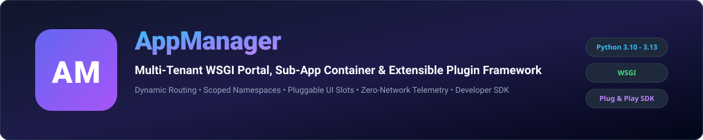
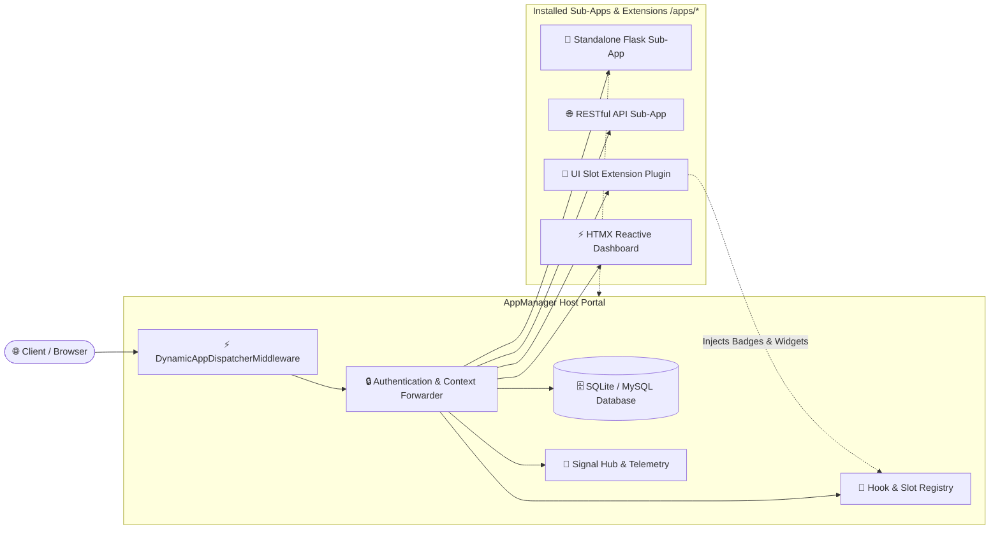

<p align="center">
  
</p>

<p align="center">
  <a href="https://github.com/r3sbarra/appmanager-server/actions"></a>
  <a href="https://pypi.org/project/appmanager-server/"></a>
  <a href="https://www.python.org/downloads/"></a>
  <a href="LICENSE"></a>
</p>

# AppManager Server (`appmanager-server`)

**AppManager Server** is a high-performance Python/Flask application portal and extension framework designed to dynamically host, dispatch, and manage standalone WSGI sub-applications and modular extensions under a unified host server.

Optimized specifically for **PythonAnywhere**, cloud VMs, and multi-tenant hosting environments, AppManager provides scoped in-process module isolation, a pluggable UI slot & lifecycle hook system, automated health monitoring, telemetry reporting, live developer tooling, a headless REST API, and per-app settings configuration.

---

## 🏛️ System Architecture

<p align="center">
  
</p>



---

## 🚀 Key Features

- 🔌 **Standard Flask Extension (`AppManager`)**: Seamlessly embeds into existing Flask applications (`AppManager(app)`) or runs as a standalone turnkey portal.
- 🔀 **Dynamic WSGI Sub-App Dispatcher**: Dynamically intercepts `/apps/<slug>/*` requests via `DynamicAppDispatcherMiddleware` and dispatches requests to installed sub-apps on-the-fly.
- 🧩 **Pluggable Hook & UI Slot System (`appmanager.hooks`)**: Mount custom HTML badges (`user_badge`), interactive cards (`dashboard_widget`), top navigation links (`nav_item`), and assets (`head_assets`) without altering host code.
- 🧰 **Developer SDK (`appmanager.sdk` / `appmanager-sdk`)**: Fluent `AppManagerClient` offering `@require_auth(role=...)`, typed user identity header parsing, telemetry metrics, and extension key-value data storage.
- ⚙️ **Per-App Settings Configuration**: Define customizable settings schemas in `manifest.json` with live configuration from the Admin Dashboard.
- 👤 **Verified Context & Header Forwarding**: Injects verified non-spoofed user identity (`X-AppManager-User-Id`, `X-AppManager-User-Email`, `X-AppManager-User-Role`, `X-Forwarded-Prefix`) directly into sub-app request headers.
- 🛠️ **Multi-Template Scaffolding & Dev Server**: Rapidly scaffold sub-apps (`appmanager new-subapp --template [basic|api|extension|htmx|full]`) and test locally in isolation with mock auth (`appmanager dev <slug>`).
- 🩺 **Automated Health Monitoring**: Sub-app health evaluation contract (`/health` endpoint or `get_health()` callable) tracked in `AppHealthLog` with one-click admin execution.
- 📊 **In-Process Telemetry Bridge**: High-performance telemetry reporting allowing sub-apps to record events and metrics directly to the host database with zero network overhead.
- 🔒 **Granular Role & Permissions Matrix**: Full RBAC role management and per-user permission matrix controlling access to every installed sub-app.

---

## 📦 Quickstart & Installation

### 1. Install via pip

```bash
pip install appmanager-server
```

CLI commands available: `appmanager-server`, `appmgr-server`, `appmanager`, or `appmgr`.

### 2. Initialize and Seed

```bash
appmanager-server init
# or: appmgr-server init / appmanager init
appmanager seed
```

### 3. Run Development Server

```bash
appmanager run
```

Navigate to `http://localhost:5000` to access the AppManager portal.

---

## 💻 Developer SDK & Sub-App Creation

### Scaffolding a New Sub-App or Extension

```bash
# Standalone Flask sub-app
appmanager new-subapp "Analytics Dashboard" --slug analytics --template basic

# RESTful JSON API sub-app
appmanager new-subapp "Payment Gateway" --slug payments --template api

# UI Slot Extension Plugin
appmanager new-subapp "User Badges" --slug user-badges --template extension

# Interactive HTMX sub-app
appmanager new-subapp "Live Monitor" --slug live-monitor --template htmx
```

### Local Sub-App Development Runner

Debug and test your sub-app locally with mock user authentication headers:

```bash
appmanager dev analytics --port 5001 --email dev@example.com --role admin
```

---

## 🛠️ Sub-App Specification (`manifest.json`)

To make an application deployable on AppManager, provide a `manifest.json` in the root:

```json
{
  "name": "Analytics Dashboard",
  "slug": "analytics",
  "version": "1.0.0",
  "description": "Standardized analytics sub-application.",
  "entry_point": "app:app",
  "health_check_path": "/health",
  "app_type": "standalone",
  "has_web_ui": true,
  "settings": {
    "api_key": {
      "type": "string",
      "default": "demo-key-12345",
      "description": "API key for external data ingestion."
    },
    "refresh_interval_sec": {
      "type": "number",
      "default": 60,
      "description": "Dashboard polling interval in seconds."
    }
  },
  "scheduled_tasks": [
    {
      "name": "daily_aggregation",
      "entry_point": "tasks:run_aggregation",
      "frequency": "daily"
    }
  ]
}
```

### Sub-App Implementation with `appmanager.sdk`

```python
from flask import Flask, jsonify, request
from appmanager.sdk import AppManagerClient

app = Flask(__name__)
client = AppManagerClient("analytics")


@app.route("/")
@client.require_auth(role="user")
def index():
    user = client.get_current_user(request.headers)
    api_key = client.get_setting("api_key", default="demo-key")
    client.report_event("dashboard_view", {"user_id": user["id"]})

    return f"<h1>Welcome, {user['email']}</h1><p>Active API Key: {api_key}</p>"


@app.route("/health")
def health():
    return jsonify({"status": "healthy", "app": "analytics"})


if __name__ == "__main__":
    app.run(port=5001, debug=True)
```

---

## 🧩 Pluggable UI Slots & Extension Hooks

Extensions can inject components into host slots:

```python
from markupsafe import Markup
from appmanager.sdk import AppManagerClient

client = AppManagerClient("banner-extension")


def render_dashboard_widget(user=None):
    return Markup('<div class="card">✨ Custom analytics summary card</div>')


# Register to the host dashboard
client.register_slot("dashboard_widget", render_dashboard_widget, priority=5)
```

Available UI slots:
- `user_badge`: Injected next to user names across profiles, tables, and headers.
- `dashboard_widget`: Mounted on the main `/dashboard` landing view.
- `nav_item`: Injected into the top navigation header bar.
- `head_assets`: Injected into the HTML `<head>` tag.

---

## 🖥️ CLI Commands

| Command | Description |
| :--- | :--- |
| `appmanager init` | Bootstrap local directory with `installed_apps/` and `.env` template |
| `appmanager run` | Start the WSGI dynamic dispatcher host server |
| `appmanager dev <slug>` | Run standalone local test server with mock authentication |
| `appmanager seed` | Seed database with default starter apps, roles, and flairs |
| `appmanager new-subapp <name>` | Scaffold a sub-app with templates (`basic`, `api`, `extension`, `htmx`, `full`) |
| `appmanager validate-subapp <path>` | Validate a sub-app folder or ZIP package against manifest rules |
| `appmanager export-app <slug>` | Package an installed sub-app into a deployable ZIP archive |
| `appmanager reload-app <slug>` | Invalidate in-memory WSGI cache for zero-downtime updates |
| `appmanager hooks` | Inspect all registered UI slots, lifecycle hooks, and listeners |
| `appmanager check-health` | Run health evaluation checks across all active sub-apps |
| `appmanager run-scheduled-tasks` | Run background scheduled cron jobs and maintenance |
| `appmanager list-apps` | List all registered applications and their operational status |
| `appmanager list-users` | List all registered users and their assigned roles |
| `appmanager set-role <email>` | Elevate or update user role (`admin` or `user`) |
| `appmanager list-roles` | List all system and custom RBAC roles |
| `appmanager create-role <name>` | Create a new custom RBAC role |

---

## 📖 Documentation

Full documentation is available at [https://appmanager.github.io/appmanager](https://appmanager.github.io/appmanager):
- [Getting Started](https://appmanager.github.io/appmanager/getting-started/)
- [Sub-App Development Guide](https://appmanager.github.io/appmanager/sub-apps/)
- [Hook & Slot Extension Guide](https://appmanager.github.io/appmanager/sub-apps/#ui-slots--extension-hooks)
- [Configuration & Settings Reference](https://appmanager.github.io/appmanager/configuration/)
- [PythonAnywhere & WSGI Deployment](https://appmanager.github.io/appmanager/deployment/)
- [CLI Reference](https://appmanager.github.io/appmanager/cli/)
- [Python API Reference](https://appmanager.github.io/appmanager/api/)

---

## 🤝 Contributing

Contributions are welcome! Please check out [CONTRIBUTING.md](CONTRIBUTING.md) and our [Code of Conduct](CODE_OF_CONDUCT.md).

---

## 📄 License

This project is licensed under the terms of the [MIT License](LICENSE).
