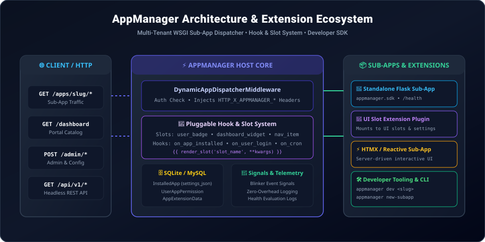
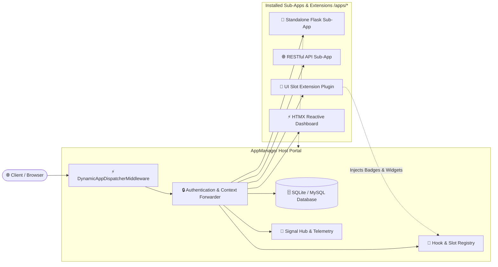

# AppManager

**AppManager** is a high-performance Python/Flask application portal and extension framework designed to dynamically host, dispatch, and manage standalone WSGI sub-applications and modular extensions under a unified host server.

Built for modular architectures and optimized for hosting environments like **PythonAnywhere**, cloud servers, and local development, AppManager provides scoped in-process module isolation, a pluggable UI slot and hook system, automated health monitoring, developer SDK tooling, telemetry reporting, and scheduled task management.

---

## 🏛️ System Architecture





---

## Key Features

- 🔀 **Dynamic WSGI Sub-App Dispatcher**: Intercepts `/apps/<slug>/*` requests via `DynamicAppDispatcherMiddleware` and routes traffic directly to installed WSGI/Flask sub-apps without restarting the host.
- 🧩 **Pluggable Hook & UI Slot System (`appmanager.hooks`)**: Extensions can mount custom badges, dashboard widgets, and navigation items dynamically.
- 🧰 **Developer SDK (`appmanager.sdk`)**: Fluent `AppManagerClient` offering `@require_auth`, header identity extraction, telemetry logging, and per-app settings.
- ⚙️ **Per-App Settings Configuration**: Define customizable settings schemas in `manifest.json` with live configuration from the Admin Dashboard.
- 🔒 **Granular Access Control (`requires_auth`)**: Toggle whether an installed app requires user authentication (`🔒 Protected`) or can be accessed publicly/anonymously (`🌐 Public`).
- 🏠 **Default Landing App (`is_default`)**: Designate a default landing application loaded automatically when users visit `/`, with `/dashboard` providing catalog access.
- 🛡️ **Scoped Namespace Isolation**: Loads sub-app modules under isolated namespaces (`appmanager.installed.<slug>`) to prevent `sys.path` and file collisions.
- 📋 **Manifest Standard (`manifest.json`)**: Auto-discovers sub-app metadata, custom entry points, health check paths, UI slots, settings schemas, and scheduled cron routines upon ZIP upload or Git clone.
- 🩺 **Standardized Health Check Contract**: Automated sub-app health evaluation (`/health` route or `get_health()` function) stored in `AppHealthLog` and displayed on the Admin Dashboard.
- 📊 **In-Process Telemetry Bridge**: Zero-network overhead telemetry and event reporting allowing sub-apps to log metrics directly to the host database.
- 🛠️ **CLI Scaffolding & Local Dev Runner**: Scaffold apps with multiple presets (`basic`, `api`, `extension`, `htmx`, `full`) and run local tests with mock authentication (`appmanager dev <slug>`).

---

## Quick Example

Install AppManager Server using pip:

```bash
pip install appmanager-server
```

Bootstrap your environment and launch the portal:

```bash
appmanager-server init
# or: appmgr-server init / appmanager init
appmanager seed

appmanager run
```

Visit `http://localhost:5000` to access the AppManager portal.
